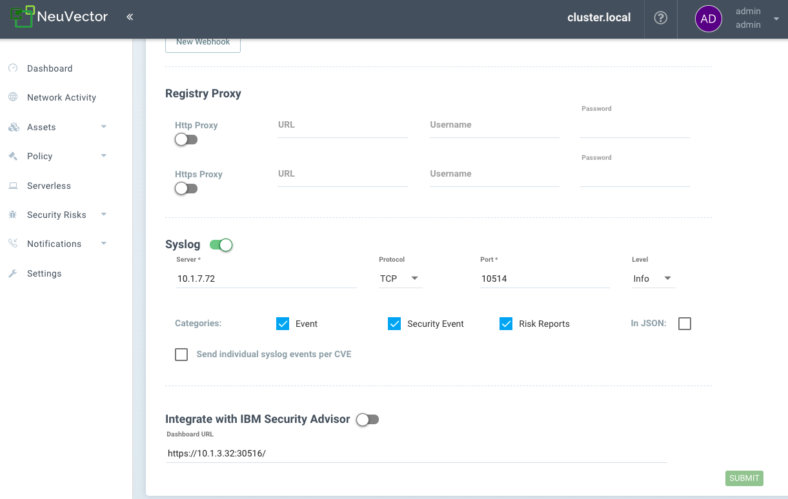

## Getting the app
### GitHub
Download the latest app tarball (`neuvector_app.tar.gz`) from the [neuvector/neuvector-splunk-app repository](https://github.com/neuvector/neuvector-splunk-app/releases).

### Splunkbase
Download the latest app tarball from [Splunkbase](https://splunkbase.splunk.com/app/6205).

### Splunk Apps Browser
In the Splunk UI, click on the Apps dropdown, click "Find More Apps", then search for NeuVector Splunk App.

## Installation and setup
Install the app by either uploading the tarball or following the Splunkbase prompts.

1. config syslog in NeuVector UI
goto Settings -> Configuration -> Syslog
a. set the server value as the IP address that the Splunk is runninng at
b. choose TCP as the protocol
c. set port number as 10514
d. choose Info Level
e. click SUBMIT to save the setting

2. You can config multiple nodes to send syslog to your splunk instance and your splunk instance will receive these syslogs in real time.
## FAQs
### What user role is required?
Any user role.

## Change notes

### December 01, 2021 - v1.0.0
- add NeuVector dashboard
